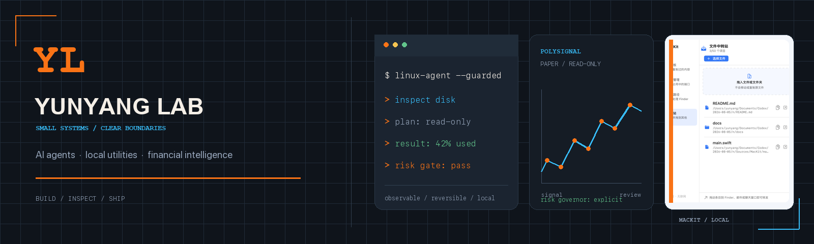

  

<h1 align="center">Hi, I'm Yunyang.</h1>

  <strong>I build inspectable AI agents and local-first tools.</strong> 
  Guarded automation · observable execution · practical software

  把复杂工作流做成可运行、可观察、可信任的工具。

  <a href="https://github.com/Zhiyunyang274?tab=repositories">Projects</a>
  · <a href="https://github.com/Zhiyunyang274/qianpulse">QianPulse</a>
  · <a href="https://github.com/Zhiyunyang274/Linux-Agent">Linux-Agent</a>
  · <a href="https://github.com/Zhiyunyang274/mackit">MacKit</a>
  · <a href="https://caixuntong.cn">Caixuntong</a>

  

    
<b>🇨🇳 中文版</b>（点击展开）

     

## 我在做什么

我做能使用工具但不沦为黑盒的 AI agents：动作应当可见、危险操作必须有明确边界、失败必须可恢复。

我的项目通常落在三个交集上：

- **AI agents** —— 工具调用、受护栏保护的执行、人类可读的结果
- **本地优先软件** —— 快速、把控制权留在用户手里的实用工具
- **信号与数据工程** —— 从嘈杂的真实世界数据中提取可信结构

## 旗舰 · QianPulse 黔脉

### [QianPulse](https://github.com/Zhiyunyang274/qianpulse) — 把日常车流变成桥梁监测网络

不新增一个传感器：过桥的车本来就带着 IMU，每次通过都是一次等待被记录的测量。QianPulse 把成百上千次嘈杂的车辆穿越融合成每座桥的频率指纹，筛查持续的响应偏移——告诉养护人员哪座桥值得优先检查。已在缩尺结构（真实 iPhone）与真实车载实测数据上完成验证。

`Python` `Streamlit` `信号处理` `Welch PSD` `JS散度` `MapLibre` `AGPL-3.0`

## 精选项目

### [Linux-Agent](https://github.com/Zhiyunyang274/Linux-Agent)

用自然语言操作 Linux：受护栏保护的执行、可回滚、结果可观察。

`Python` `LLM agents` `自动化` `运维`

### [MacKit](https://github.com/Zhiyunyang274/mackit)

原生 macOS 菜单栏工具箱：剪贴板历史、端口管理、Finder 路径、临时文件传输。

`Swift` `AppKit` `SwiftUI` `macOS`

### [PolySignal Pro](https://github.com/Zhiyunyang274/polysignal-pro)

市场情报与模拟交易：显式风险边界 + 本地只读控制台。

`Python` `行情数据` `回测` `风控`

### [财讯通](https://caixuntong.cn)

我创立并持续迭代的金融资讯产品。

`产品开发` `金融资讯` `Web`

## 我的做事方式

- 让动作可观察，而不是藏在精致界面背后。
- 给有真实后果的操作加上明确护栏。
- 偏好小反馈回路、可逆变更、能跑起来的原型。
- 让系统始终能被理解、调试和改进。
- 区分证据与模拟——每个数字都应可追溯。

## 关于我

- 华南理工大学 计算机科学与技术，辅修金融
- 独立 Apple 开发者，多款 App 已上架 App Store
- 黑客松选手，喜欢把粗糙想法快速做成能用的产品
- WorldQuant Global Challenge Top 100

## 近况

正在推进 QianPulse（在线演示 + 开源）、构建更安全的工具型 agents、打磨 macOS 本地软件。

  

---

## What I build

I work on AI agents that can use tools without becoming black boxes: their actions should be visible, risky operations should have clear boundaries, and failures should be recoverable.

My projects usually sit at the intersection of:

- **AI agents** - tool use, guarded execution and human-readable outcomes
- **Local-first software** - fast utilities that keep users in control
- **Signal & data engineering** - extracting trustworthy structure from noisy real-world data

## Featured · QianPulse 黔脉

### [QianPulse](https://github.com/Zhiyunyang274/qianpulse) — turn everyday traffic into a bridge-monitoring network

No new sensors: vehicles crossing a bridge already carry IMUs, and their
crossings are measurements waiting to be recorded. QianPulse fuses hundreds
of noisy vehicle trips into a per-bridge frequency fingerprint and screens
persistent response shifts — telling maintenance crews which bridge deserves
inspection first. Validated on a scale model with a real iPhone, and on real
drive-by field data.

`Python` `Streamlit` `signal processing` `Welch PSD` `JS divergence` `MapLibre` `AGPL-3.0`

## Selected projects

### [Linux-Agent](https://github.com/Zhiyunyang274/Linux-Agent)

Natural-language Linux operations with guarded execution, rollback and observable results.

`Python` `LLM agents` `automation` `operations`

### [MacKit](https://github.com/Zhiyunyang274/mackit)

A native macOS menu-bar toolbox for clipboard history, port management, Finder paths and temporary file transfer.

`Swift` `AppKit` `SwiftUI` `macOS`

### [PolySignal Pro](https://github.com/Zhiyunyang274/polysignal-pro)

Market intelligence and simulated trading with explicit risk boundaries and a local read-only console.

`Python` `market data` `backtesting` `risk controls`

### [Caixuntong](https://caixuntong.cn)

A financial information product I created and continue to develop.

`Product development` `financial information` `web`

## How I build

- Make actions observable instead of hiding them behind polished interfaces.
- Put explicit guardrails around operations with real consequences.
- Prefer small feedback loops, reversible changes and working prototypes.
- Keep systems understandable enough to inspect, debug and improve.
- Separate evidence from simulation — every number should be traceable.

## A little more about me

- Computer Science and Technology at South China University of Technology, with a minor in Finance
- Independent Apple developer with multiple apps published on the App Store
- Hackathon builder who enjoys turning rough ideas into working products quickly
- WorldQuant Global Challenge Top 100

## Currently

Shipping QianPulse (live demo + open source), building safer tool-using agents, and improving local software for macOS.

  
  

  <a href="https://github.com/Zhiyunyang274?tab=repositories"><strong>Explore all projects →</strong></a>

